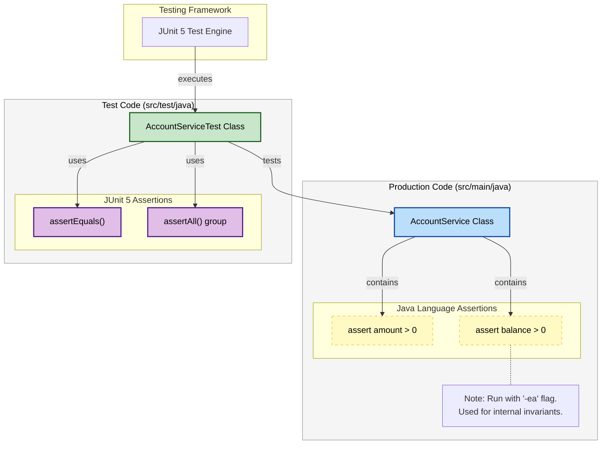
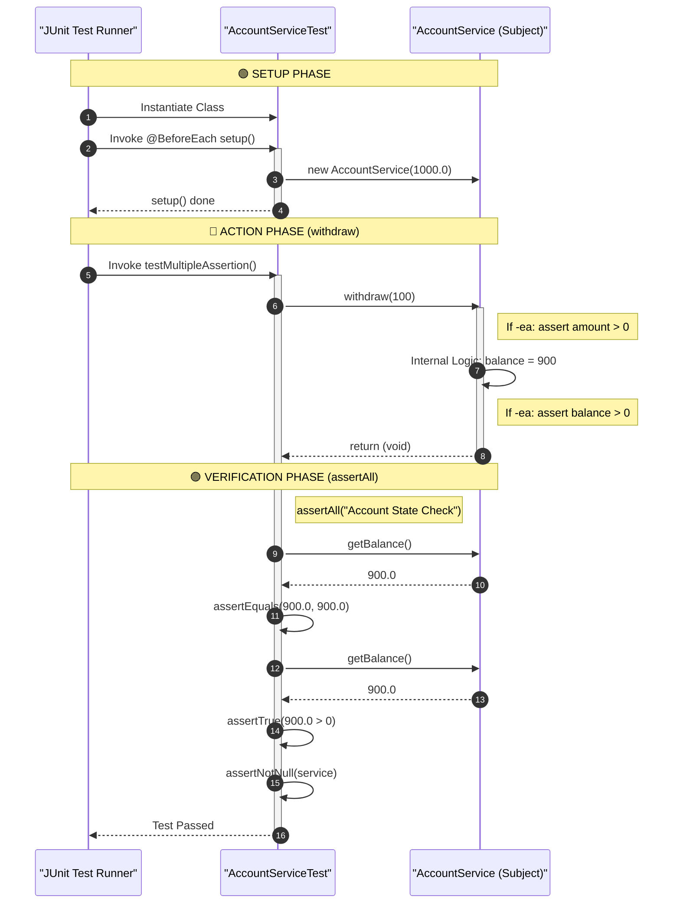

#  Robust Testing: Java Assertions vs. JUnit 5

## Overview

Reliable software requires testing at two levels:

1. **Internal Defensive Programming**: Checking that the system's internal state is never corrupted.
2. **External Unit Testing**: Validating that the code behaves correctly from the user's perspective.

---

##  Core Concepts

### 1. Java Keyword: `assert`

In `AccountService.java`, we use the native `assert` keyword.

* **Purpose**: To catch "impossible" scenarios during development (e.g., a bank balance somehow dropping below zero).
* **Syntax**: `assert [condition] : [Error Message]`.
* **Note**: These are disabled by default in production for performance. They are meant for developers to catch logic flaws early.

### 2. JUnit 5 Assertions

In `AccountServiceTest.java`, we use the industry-standard JUnit 5 library. Unlike native assertions, these are designed to be part of a **Continuous Integration (CI)** pipeline.

* **`assertEquals(expected, actual)`**: Ensures the math is correct.
* **`assertTrue(condition)`**: Validates boolean logic.
* **`assertAll()`**: A powerful "Grouped Assertion." Even if the first check fails, JUnit will continue to run the rest of the checks in the block, providing a complete report of what went wrong.

---
This example elegantly contrasts two different ways to ensure code correctness in Java: internal **language-level assertions** intended for development/debugging, and external **framework-level assertions** used for formal unit testing with JUnit 5.

Here are the architectural and sequence diagrams illustrating these concepts.

---

### 1. High-Level Architecture & Assertion Types

This diagram shows the relationship between your production code, test code, and the different assertion mechanisms.

**Key Takeaway:**

* **Java Assertions (`assert`):** Live **inside** your production code (`AccountService`). They are designed to catch internal state corruption or "impossible" conditions. They are **disabled by default** and must be enabled with the `-ea` (enable assertions) JVM flag.
* **JUnit Assertions (`Assertions.*`):** Live **inside** your test code (`AccountServiceTest`). They are the primary tool for verifying that your code meets its public specification. They **always run** during tests.



---

### 2. Sequence Diagram: Test Execution Flow (`testMultipleAssertion`)

This diagram traces the execution of the `testMultipleAssertion` test method. It highlights where Java assertions happen versus where JUnit assertions happen, and shows how `assertAll` executes multiple checks.

**Key Takeaway:** Notice how the **Java `assert**` statements are executed as part of the application logic inside `AccountService.withdraw()`, whereas the **JUnit `assertAll**` is a separate validation phase that happens after the action is complete.


---
##  Component Reference

### `AccountService.java`

This is our "System Under Test" (SUT). It contains a simple withdrawal logic with defensive checks.

* It ensures the input is positive *before* doing work.
* It ensures the system state is valid *after* doing work.

### `AccountServiceTest.java`

The test suite that acts as a "Robot Client."

* **`@BeforeEach`**: Ensures that every test starts with a fresh  balance, preventing one test from affecting the result of another (Isolation).
* **`@DisplayName`**: Makes the test reports readable for humans (e.g., "Verified Success Withdrawal" instead of just a method name).

---

##  Execution & Observations

### Enabling Native Assertions

To see the `assert` keyword in action in your IDE, you must add the `-ea` (Enable Assertions) flag to your **VM Options**. If you try to withdraw a negative amount with `-ea` enabled, the program will throw an `AssertionError`.

### Running JUnit Tests

When you run the test class:

1. `setup()` runs (Balance = 1000).
2. `testWithdrawSuccess()` runs (Balance becomes 800).
3. `setup()` runs again (Balance resets to 1000).
4. `testMultipleAssertion()` runs (Balance becomes 900 and passes 3 checks).

---

## ️ Key Takeaways

* **Fail Fast**: By using assertions, your code stops immediately when a logic error is detected, making debugging much easier.
* **Grouped Assertions**: `assertAll` is superior for complex objects because it gives you a full summary of failures rather than stopping at the first error.
* **Documentation**: Well-written tests serve as "living documentation" for your code.
- **Assertions (`assert`)**: Used to check assumptions in code. If the condition is false, the program throws an `AssertionError`.
- **Enable/Disable Assertions**: By default, assertions are disabled. You must run your program with `java -ea` to enable them.
- **Purpose**: Assertions are not for handling user errors but for catching programming mistakes during development/testing.
- **Balance Logic**: Ensures withdrawals are valid and the account never goes negative.


- **JUnit 5 Annotations**:
    - `@Test`: Marks a method as a test case.
    - `@BeforeEach`: Runs before each test to set up fresh state.
    - `@DisplayName`: Adds human-readable names to tests.
- **Assertions**:
    - `assertEquals(expected, actual)`: Checks if values match.
    - `assertTrue(condition)`: Checks if condition is true.
    - `assertNotNull(object)`: Ensures object is not null.
    - `assertAll()`: Groups multiple assertions together.
- **Purpose of Tests**: Ensures your business logic (like withdrawals) works correctly and prevents bugs.


---
Example Run (with assertions enabled):
```java
AccountService account = new AccountService();
account.withdraw(200);   // Works fine
account.withdraw(-50);   // AssertionError: "Withdrawal amount must be positive!"
```
---

 Example Output when running tests:
```
Bank Account Testing ✔
  Verified Success Withdrawal ✔
  Verify Multiple Conditions ✔
```

---
